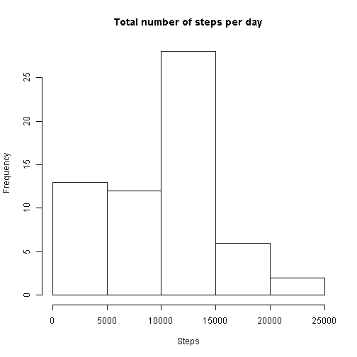
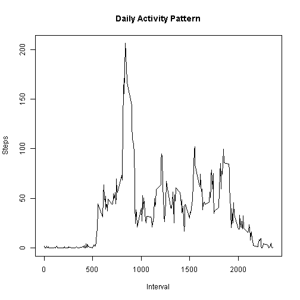
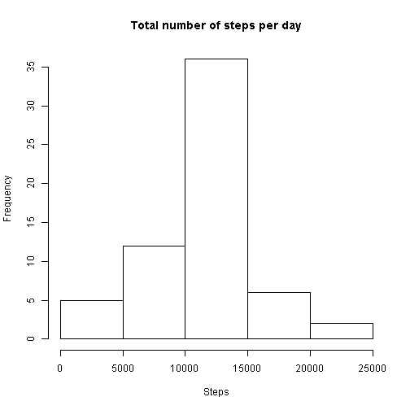
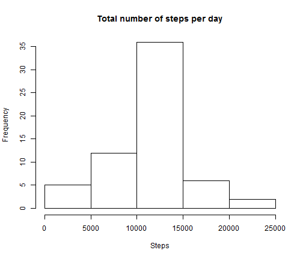

### IMPRORTANT NOTE! For the code to work input file "activity.csv" should be in the working directory

## Loading and preprocessing the data

```r
echo = TRUE
#load plyr,ggplot2,knitr & lubridate packages
library(plyr)
library(lubridate)
library(ggplot2)
library(knitr)
dataset<-read.csv("activity.csv")
```


## What is mean total number of steps taken per day?

First we create the daily mean Histogram


```r
echo = TRUE
dailySteps<-tapply(dataset$steps,dataset$date,sum,na.rm=TRUE)
hist(dailySteps,main="Total number of steps per day",xlab="Steps")
```

 

Then we calculate Mean and Median values


```r
echo = TRUE
mean(dailySteps,na.rm=TRUE)
```

```
## [1] 9354.23
```

```r
median(dailySteps,na.rm=TRUE)
```

```
## [1] 10395
```
## What is the average daily activity pattern?

First we make the graph 


```r
echo = TRUE
fiveMinuteSteps<-ddply(dataset,.(interval),summarize,steps=mean(steps,na.rm=TRUE))
plot(fiveMinuteSteps,type="l",xlab="Interval",ylab="Steps",main="Daily Activity Pattern")
```

 

And then calculate the maximum value


```r
echo = TRUE
max(fiveMinuteSteps)
```

```
## [1] 2355
```

## Imputing missing values

Question 1: Using complete.cases function we calculate the extracted lines as the number of missing values


```r
echo = TRUE
nrow(dataset[!complete.cases(dataset),])
```

```
## [1] 2304
```

Question2: The NA values are replaced with the time interval average of the 2-month period

Question3: Excecute the above strategy


```r
echo = TRUE
intervals<-levels(as.factor(dataset$interval))
matches<-match(dataset$interval,as.numeric(intervals))
datasetNew<-data.frame(steps=ifelse(is.na(dataset$steps),fiveMinuteSteps$steps[matches],dataset$steps),
                       date=dataset$date,interval=dataset$interval)
```

Question4: 

First make the Histogram


```r
echo = TRUE
dailyStepsNew<-tapply(datasetNew$steps,datasetNew$date,sum,na.rm=TRUE)
hist(dailyStepsNew,main="Total number of steps per day",xlab="Steps")
```

 

Then calculate mean and median values


```r
echo = TRUE
mean(dailyStepsNew,na.rm=TRUE)
```

```
## [1] 10766.19
```

```r
median(dailyStepsNew,na.rm=TRUE)
```

```
## [1] 10766.19
```

Comparing the results we come to the conclusion that removing NA values had an observable impact on the total number of steps calculated per day. This is not surpising as approximately 13.1% of the total records were NAs, very close actually to the increase of the mean value. Interestingly the distribution of steps seems to change before and after removing NAs as well.

## Are there differences in activity patterns between weekdays and weekends?

First we create a new factor variable in our dataset


```r
echo = TRUE
datasetNew$date<-ymd(datasetNew$date)
datasetNew$day<-as.factor(weekdays(datasetNew$date))
datasetNew$day<-ifelse(datasetNew$day=="Saturday"|datasetNew$day=="Sunday","weekend","weekday")
```

And then create the panel plot using function qplot from ggplot2 package


```r
echo = TRUE
datasetNew2<-ddply(datasetNew,.(interval,day),summarize,steps=mean(steps))
qplot(interval,steps,data=datasetNew2,facets=day~.,geom="line",main="Daily Activity Pattern", ylab="Number of steps")
```

 

The two graphs clearly show change in the activity patterns between weekends and weekdays. Weekends tend to have a smoother distribution of steps within the day, as well as different sleeping and waking up hours. Weekends also show an overall higher number of steps compared to weekdays. 
